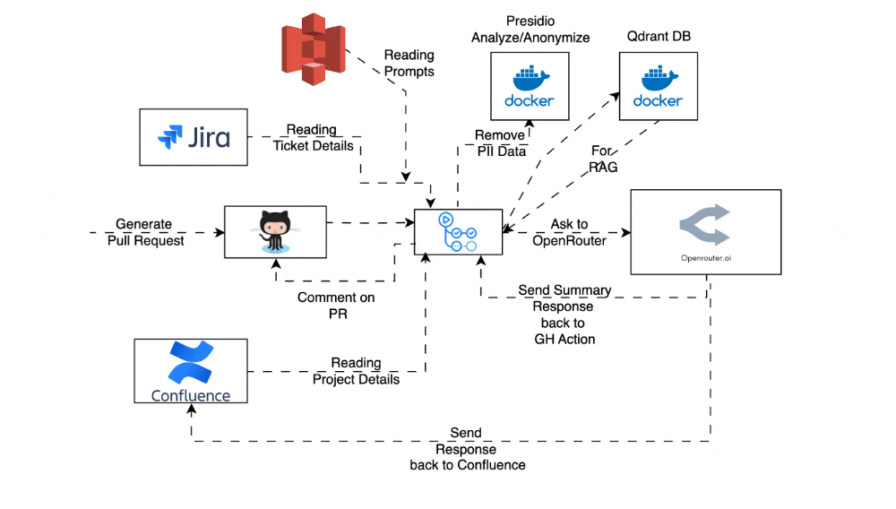

# Check Quality of Unit Testcases

GitHub Actions CI/CD


AI-powered GitHub Action for analyzing unit test quality and coverage metrics.

## Features
- Automated test quality assessment using AI analysis
- Jira integration for issue tracking.
- Customizable quality thresholds
- GitHub Actions CI/CD integration

## Prerequisites
- Node.js 18+
- npm 9+
- GitHub Actions environment
- Test list reports should be present in ./coverage/ut-results.json

## GitHub Actions Integration
Add to your workflow (`.github/workflows/quality-check.yml`):
```yaml
name: Test Quality Check
on: [push, pull_request]

jobs:
  analyze:
    runs-on: ubuntu-latest
    steps:
      - uses: actions/checkout@v4
      - name: Extract branch name
        id: extract
        run: |
          echo "branch=${{ github.head_ref }}" >> $GITHUB_OUTPUT

      - name: Run OpenRouterAI Test Quality Checker
        id: run-check-quality-of-unit-testcases-openrouterai
        uses: sfvishalgupta/check-quality-of-unit-testcases@v3.0
        with:
          AWS_ACCESS_KEY: ${{ secrets.AWS_ACCESS_KEY_UT || '' }}
          AWS_REGION: ${{ vars.AWS_REGION_UT || '' }}
          AWS_SECRET_KEY: ${{ secrets.AWS_SECRET_KEY_UT || '' }}
          DOCKER_PASSWORD: ${{ secrets.DOCKER_PASSWORD || '' }}
          DOCKER_USERNAME: ${{ vars.DOCKER_USERNAME || '' }}
          GITHUB_TOKEN: ${{ secrets.GITHUB_TOKEN }}
          JIRA_API_TOKEN: ${{ secrets.JIRA_API_TOKEN }}
          JIRA_EMAIL: ${{ vars.JIRA_EMAIL }}
          JIRA_PROJECT_KEY: ${{ vars.JIRA_PROJECT_KEY }}
          JIRA_URL: ${{ vars.JIRA_URL }}
          OPEN_ROUTER_API_KEY: ${{ secrets.OPEN_ROUTER_API_KEY }}
          OPEN_ROUTER_MODEL: ${{ vars.OPEN_ROUTER_MODEL }}
          PROJECT_DOCUMENT_PATH: ${{ vars.PROJECT_DOCUMENT_PATH || '' }}
          S3_BUCKET_NAME: ${{ vars.S3_BUCKET_NAME_UT || '' }}
          USE_FOR: ${{ vars.USE_FOR || '' }}
          JIRA_URL_OUTPUT: ${{vars.JIRA_URL_OUTPUT}}
          JIRA_EMAIL_OUTPUT: ${{vars.JIRA_EMAIL_OUTPUT}}
          JIRA_API_TOKEN_OUTPUT: ${{secrets.JIRA_API_TOKEN_OUTPUT}}
      
```

## Setup Files
### Angular
* Place the files in Angular Project [Angular Setup](./src/angular/)
* **karma-json-result-reporter** is required to evaluate test cases.
* In your **karma.conf.js** add

```javascript
  plugins: [
    ...
    'karma-json-result-reporter',
    ...
  ];

  reporters: [
    'json-result'
    ...
  ],
```

You will also need to set the location that you need to output your JSON file.
```javascript
jsonResultReporter: {
  outputFile: "karma-result.json",
  isSynchronous: true (optional, default false)
}
```

### Loopback
* Place the files in Loopback Project [Loopback Setup](./src/loopback/)

## Configuration
### Secrets
* `AWS_ACCESS_KEY_UT`
* `AWS_SECRET_KEY_UT`
* `DOCKER_PASSWORD`
* `JIRA_API_TOKEN`
* `OPENROUTER_AI_API_KEY`
* `JIRA_API_TOKEN_OUTPUT`

### Variables
* `AWS_REGION_UT`
* `DOCKER_USERNAME`
* `JIRA_EMAIL`
* `JIRA_PROJECT_KEY`
* `JIRA_URL`
* `OPEN_ROUTER_MODEL`
* `PROJECT_DOCUMENT_PATH`
* `S3_BUCKET_NAME_UT`
* `USE_FOR`
* `JIRA_EMAIL_OUTPUT`
* `JIRA_URL_OUTPUT`
* `JIRA_SPACE_KEY_OUTPUT`

#### OpenRouter AI API Configuration
To integrate the OpenRouter AI API into your application, you'll need to provide the following configuration details:
**`OPENROUTER_AI_API_KEY`:** Your OpenRouter AI API key, used for authentication and authorization.
**`OPEN_ROUTER_MODEL`:** The specific AI model to use for API calls, which determines the capabilities and behavior of the AI.
**`USE_FOR`:** Specifies the purpose or context in which the OpenRouter AI API will be used. Currently, two options are supported:
`GenerateTestCasesReport_API`: Use the OpenRouter AI API for generating test case reports via API calls.
`GenerateTestCasesReport_UI`: Use the OpenRouter AI API for generating test case reports in a user interface context.

By providing these configuration details, you'll be able to leverage the OpenRouter AI API to generate high-quality test case reports tailored to your specific use case.

#### Jira Configuration for Confluence Integration
To enable the project to retrieve documents from Confluence, you'll need to provide the following Jira configuration details:
**`JIRA_URL`:** The base URL of your Jira instance, used for API interactions.
**`JIRA_EMAIL`:** The email address associated with the Jira account that will be used to authenticate API requests.
**`JIRA_API_TOKEN`:** The API token for the Jira account, used for authentication.
**`JIRA_PROJECT_KEY`:** The project key of the Confluence project that contains the documents to be retrieved.

These configuration details are required to successfully connect to your Confluence instance and retrieve project documents.

#### Jira Output Configuration for Confluence Integration
To enable the Quality Checker to output its results to Confluence, you'll need to provide the following Jira configuration details:
**`JIRA_URL_OUTPUT`:** The base URL of your Jira instance, used for API interactions.
**`JIRA_EMAIL_OUTPUT`:** The email address associated with the Jira account that will be used to authenticate API requests.
**`JIRA_API_TOKEN_OUTPUT`:** The API token for the Jira account, used for authentication.
**`JIRA_SPACE_KEY_OUTPUT`:** The space key of the Confluence space where the Quality Checker output will be published.

These configuration details are required to successfully integrate the Quality Checker with your Confluence instance and publish output to the specified space.

#### AWS Credentials for S3 Bucket Access
If your project utilizes an S3 bucket to store prompts and/or project documents, you'll need to provide the following AWS credentials:
**`AWS_ACCESS_KEY_UT`:** Your AWS access key ID for authenticating with the S3 bucket.
**`AWS_SECRET_KEY_UT`:** Your AWS secret access key for authenticating with the S3 bucket.
**`AWS_REGION_UT`:** The AWS region where your S3 bucket is hosted.
**`S3_BUCKET_NAME_UT`:** The AWS S3 Bucket where Prompt file or project documents are present.

These credentials are required to access and retrieve data from the S3 bucket. If your project doesn't use an S3 bucket, you can disregard these variables.

#### Docker Hub Credentials
To pull the required Docker images for the Presidio Analyzer, Presidio Anonymizer, and Qdrant, you'll need to provide the following Docker Hub credentials:
**`DOCKER_USERNAME`:** Your Docker Hub username, used for authentication.
**`DOCKER_PASSWORD`:** Your Docker Hub password or access token, used for authentication.

These credentials are required to access the following Docker images:
`mcr.microsoft.com/presidio-analyzer`
`mcr.microsoft.com/presidio-anonymizer`
`qdrant/qdrant`

By providing your Docker Hub credentials, you'll be able to pull these images and use them in your application.

## Workflow


## Contributing
1. Fork the repository
2. Create feature branch (`git checkout -b feature/improvement`)
3. Commit changes (`git commit -am 'Add new feature'`)
4. Push to branch (`git push origin feature/improvement`)
5. Open Pull Request

## License
MIT © 2025 Vishal Gupta

## Support
Contact: vishal.gupta@sourcefuse.com
